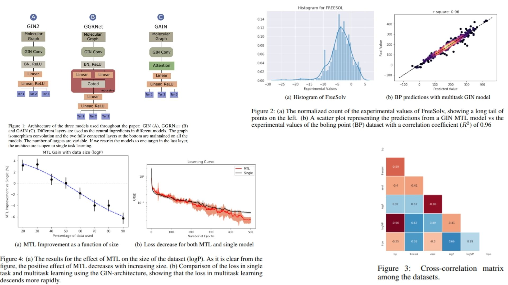

# ⚗️ MTL-GNN-Replication — Masked Multi-Task Learning on Graph Neural Networks

This repository provides a **clean, forward-only PyTorch replication** of a  
**Multi-Task Learning Graph Neural Network (MTL-GNN)** designed to study how
**shared graph representations** behave under **multiple, partially observed tasks**.

The purpose is **architectural and representational fidelity**: translating the
core ideas of **shared graph encoding, task-specific readouts, and masking-based
task decoupling** into minimal, readable code — **without training pipelines,
datasets, or benchmark optimization**.

The focus is strictly on how a **single graph embedding** can support **diverse
prediction objectives** simultaneously, while mitigating negative task
interference through masking ✣.

Paper reference:  [Multitask Learning On Graph Neural Networks
Applied To Molecular Property Predictions (arXiv)](https://arxiv.org/abs/1910.13124) ⌬


---

## Overview — One Graph, Many Perspectives ◈



>Graph-structured data often supports multiple learning objectives, where each
>task captures a different semantic aspect of the same underlying structure.

In naive settings, learning these tasks independently leads to:
- Redundant encoders
- Fragmented representations
- Poor generalization across tasks

MTL-GNN addresses this by learning:
- A **shared graph encoder** that captures global structure
- **Task-specific heads** that interpret this representation differently
- **Masks** that selectively ignore irrelevant signal per task

The result is a model that learns **what is common** once, and **what is specific**
only where needed.

---

## Graph Representation Setting 🧮

Consider a graph:

$$
G = (V, E)
$$

with node features

$$
X \in \mathbb{R}^{N \times d}
$$

A shared GNN encoder produces node-level embeddings:

$$
H = \text{GNN}(X, E), \quad H \in \mathbb{R}^{N \times d'}
$$

---

### Global Graph Readout

To obtain a graph-level representation, a permutation-invariant readout function
is applied:

$$
h_G = \text{READOUT}(H)
$$

In this replication, a simple mean pooling is used:

$$
h_G = \frac{1}{N} \sum_{i=1}^{N} h_i
$$

This vector serves as a **global summary of the graph**, shared across all tasks.

---

## Masked Multi-Task Heads 🎭

Each task $t$ is equipped with its own prediction head:

$$
y_t = f_t(h_G)
$$

To control task interference, a **masking mechanism** is applied:

$$
\tilde{h}_G^{(t)} = M_t \odot h_G
$$

where:
- $M_t$ is a task-specific mask
- $\odot$ denotes element-wise multiplication

This allows each task to:
- Attend to only relevant dimensions
- Ignore misleading shared features
- Benefit from shared structure without being dominated by other objectives

---

## Why This Matters 🧠

This structure is especially suitable for:
- Multi-property prediction on molecular graphs
- Heterogeneous labels with partial supervision
- Studying negative vs positive transfer in GNNs
- Research-focused representation learning

---

## Repository Structure 🗃️

```bash
MTL-GNN-Replication/
├── src/
│   ├── utils/
│   │   ├── graph_visualization.py      
│   │   └── task_mask.py                 
│   │
│   ├── layers/
│   │   ├── gin_conv.py                  
│   │   └── graph_readout.py            
│   │
│   ├── blocks/
│   │   └── gin_block.py                 
│   │
│   ├── models/
│   │   ├── encoder_stub.py              
│   │   ├── multitask_head_stub.py       
│   │   └── counting_feature.py          
│   │
│   ├── pipeline.py                     
│   └── config.py                        
│
├── images/
│   └── figmix.jpg             
│
├── requirements.txt                    
└── README.md     
```
---


## 🔗 Feedback

For questions or feedback, contact: [barkin.adiguzel@gmail.com](mailto:barkin.adiguzel@gmail.com)
